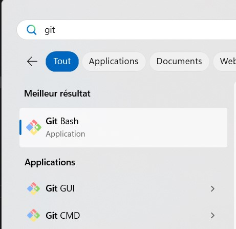
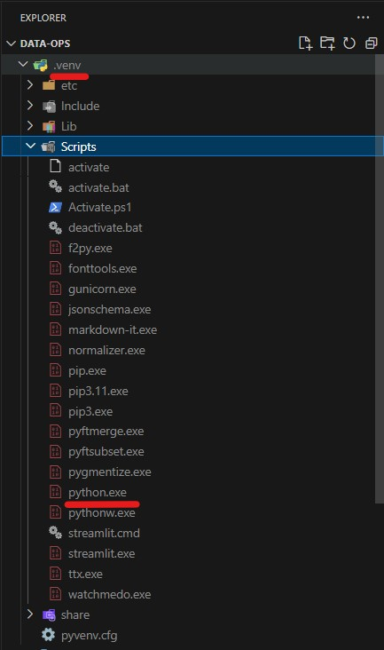
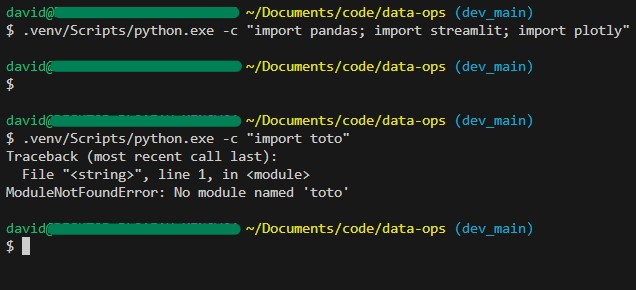
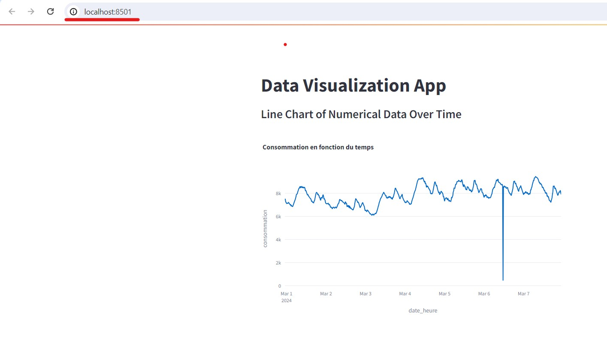

## Objectifs
- Mettre en place l'environnement de travail du dataops
  - outils installés et configurés : git, VSCode, heroku, python
- Initialiser le projet

## Réalisations

### Pré-requis

Python 3 est installé sur votre pc. Pour le vérifier, ouvrir un terminal (CMD, Powershell, bash, etc) et exécuter `python --version`.
Le retour devrait afficher un numéro de version tel que `3.X.YY`

Si ce n'est pas le cas, il faudra l'installer. De l'aide peut être trouvée ici : https://docs.python.org/fr/3/using/index.html

### Local - Outils - VScode, git
- download and install vscode; install following extensions
  - GitLens - Gitsupercharged
  - JSON Formatter
  - Pylance
  - Python
  - Python debugger
- download and install git : https://git-scm.com/downloads
  - conserver les choix par défaut lors de l'installation

#### Résultat attendu dans VSCode

Extensions installées dans VSCode


Git installé



### Cloud - Outils - Heroku
- create an account on Heroku: https://signup.heroku.com/
  > ATTENTION : la réalisation de l'ensemble des travaux pratiques peut être faite avec un compte gratuit; l'ajout d'un moyen de paiement n'est pas nécessaire et, par conséquent, non recommandé pour ce cours. Le personnel d'enseignement ne pourrait être tenu responsable de l'action d'ajouter un moyen de paiement et des coûts qui en résulteraient.

  > A noter que l'inscriptiion à Heroku demande de définir une double authentification par MFA. Si vous n'avez pas d'applications équivalentes déjà installées, la procédure est présentée au cours de l'inscription.
- download, install and setup CLI: https://devcenter.heroku.com/articles/getting-started-with-python#set-up
  - après cette étape, vous aurez initié la connexion à heroku depuis votre PC via un terminal de commandes

#### Résultats attendus

Compte Héroku créé


Interface en lignes de commande installée (CLI)


### Local - projet
- installer les fichiers du projet (quid archive ou clone ?)
  - option clonage
    - exécuter la commande `git clone https://github.com/blachon/data-ops.git`
- create a venv
  - lien : https://devcenter.heroku.com/articles/getting-started-with-python#install-app-dependencies-locally
  - ouvrir une invite de commandes (powershell ou git bash de préférence)
  - se positionner à la racine du projet
  - créer l'environnement venv tel qu'expliqué
  - activer l'environnement (utile pour la suite du projet)
  - installer les librairies du projet à l'aide du fichier `requirements.txt` à la racine du projet
- activate the venv for the project in VSCode
  - lien : https://code.visualstudio.com/docs/python/environments#_working-with-python-interpreters
  - choisir l'environnement du projet `.venv`

#### Note sur l'exécution de scripts locaux
Sur certains PC (Windows en particulier), l'exécution d'un script peut être bloquée (observé pour Powershell). Si c'est le cas, de l'aide peut être trouvée sur la page ci-dessous.

En particulier, si tel est le cas, il est possible de donner l'autorisation d'exécuter des scripts temporairement (pour la session ouverte dans Powershell) avec la commande suivante. 
A la suite de cette commande, exécuter la ligne qui permet d'activer l'environnement.
```
Set-ExecutionPolicy -ExecutionPolicy Bypass -Scope Process
```

 https://learn.microsoft.com/fr-fr/powershell/module/microsoft.powershell.core/about/about_execution_policies?view=powershell-7.4


#### Résultats attendus

Environnement virtuel créé



Librairies installées : afin de valider la bonne installation des librairires, il est recommandé d'effectuer les deux commandes suivantes (aussi illustrées par la capture ci-après)
```
$ .\.venv\Scripts\python.exe -c "import pandas; import streamlit; import plotly"
# rien ne devrait être retourné

$ .\.venv\Scripts\python.exe -c "import toto"
Traceback (most recent call last):
  File "<string>", line 1, in <module>
ModuleNotFoundError: No module named 'toto'
```



Environnement activé dans VScode


### Local - tout relier
Pré-requis : avoir l'environnement activé

- run the app locally
  - la commande : `$ heroku local -f Procfile.windows`
  - lien : https://devcenter.heroku.com/articles/getting-started-with-python#run-the-app-locally

> A noter que la commande est différente car le fichier procfile n'attend pas de paramètre

> A noter aussi que lors du premier lancement de streamlit, un message demandant d'entrer un email peut apparaître dans la console et stopper le process. Il est recommandé d'arrêter le lancement (avec la commande `Ctrl + C`), puis d'exécuter la commande `streamlit hello` (dans le même terminal) afin de pouvoir passer cette étape. Suite à ça, on peut stopper ce process et relancer la commande initiale pour exécuter notre projet.

#### Résultats attendus

Application lancée en local



Vue de la commande


# tp2

